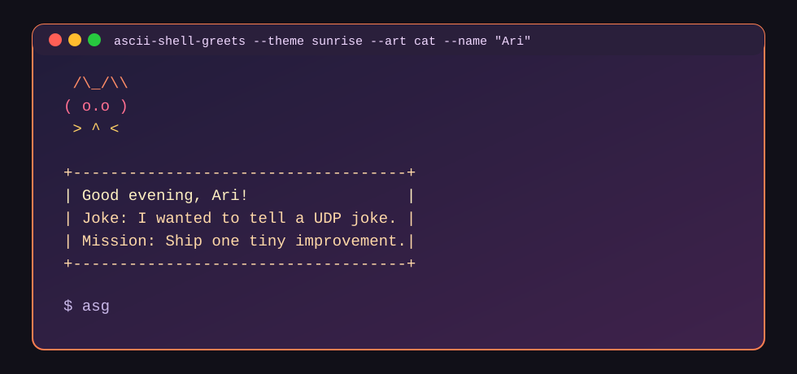
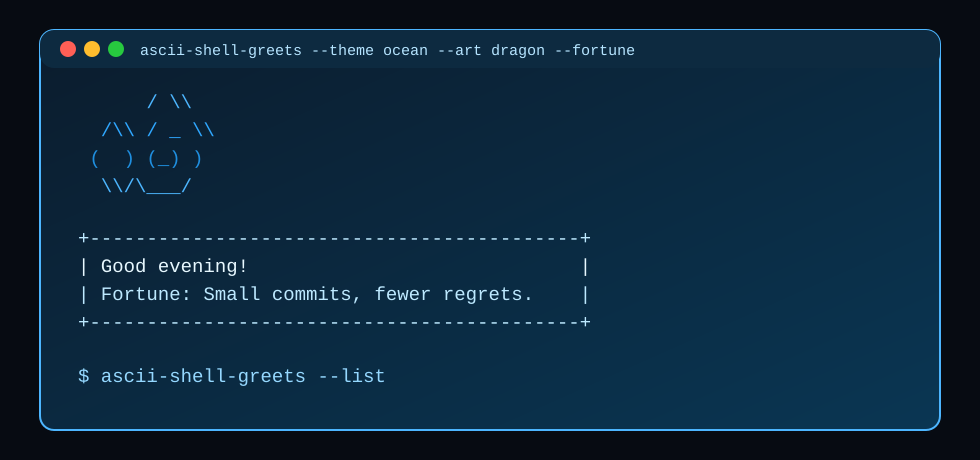
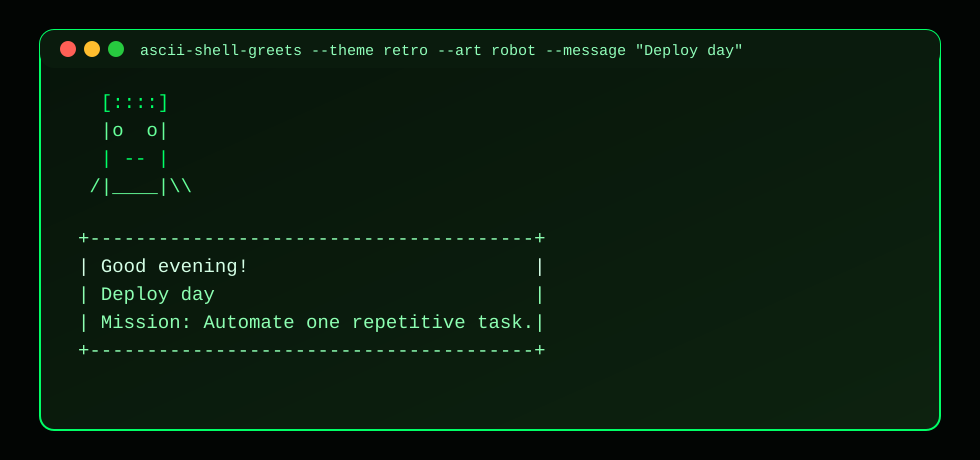

# ascii-shell-greets

Be greeted with colorful ASCII art whenever you open a shell.

`ascii-shell-greets` is a modern reboot of the original package, rebuilt with configuration, themes, shell setup tooling, and extra fun output.

## Features

- Multiple ASCII characters (`cat`, `robot`, `coffee`, `octopus`, `dragon`, `terminal`, or random)
- Color themes (`sunrise`, `ocean`, `forest`, `retro`, `fire`, `mono`)
- Time-based greeting (`Good morning`, `Good afternoon`, `Good evening`)
- Random jokes, daily missions, and optional fortune lines
- Config file support (`~/.ascii-shell-greets.json`)
- Interactive setup that asks whether to run on terminal startup
- Optional short alias (`asg` by default, customizable)
- Startup hook automation (`setup` and `doctor`)

## Install

```bash
npm install -g ascii-shell-greets
```

During interactive global installs, setup asks if you want:

- Auto-greeting on new terminal sessions
- A short alias for the command

Skip setup prompts with:

```bash
ASG_SKIP_SETUP=1 npm install -g ascii-shell-greets
```

## Quick Usage

```bash
ascii-shell-greets
ascii-shell-greets --theme ocean --art robot --name "Captain"
ascii-shell-greets --no-joke --fortune --message "Today is release day."
ascii-shell-greets --list
```

## Sample Output

### Sunrise Cat



### Ocean Dragon



### Retro Robot



## Commands

### Greet

```bash
ascii-shell-greets [options]
```

Options:

- `-n, --name <name>`
- `-t, --theme <theme>`
- `-a, --art <art>`
- `-m, --message <text>`
- `--joke` / `--no-joke`
- `--mission` / `--no-mission`
- `--fortune` / `--no-fortune`
- `--time` / `--no-time`
- `--color` / `--no-color`
- `--config <path>`
- `--list`

### Setup shell startup hook

```bash
ascii-shell-greets setup
ascii-shell-greets setup --shell bash
ascii-shell-greets setup --shell zsh --dry-run
ascii-shell-greets setup --alias asg
ascii-shell-greets setup --no-startup --alias wow
```

Setup options:

- `--alias <name>`
- `--no-alias`
- `--startup` / `--no-startup`
- `--interactive` / `--no-interactive`

### Doctor

```bash
ascii-shell-greets doctor
```

Checks `zsh`, `bash`, and `fish` shell rc files for startup and alias status.

## Config file

Default path: `~/.ascii-shell-greets.json`

Example:

```json
{
  "enabled": true,
  "name": "Ari",
  "theme": "sunrise",
  "art": "random",
  "showTime": true,
  "showJoke": true,
  "showMission": true,
  "showFortune": false,
  "color": true,
  "message": "Make it fun."
}
```

CLI flags override config values.

## Development

```bash
npm test
node bin/ascii-shell-greets.js --no-color
```

## Contributing

Bug reports and pull requests are welcome at:

- [https://github.com/ai-armageddon/ASCII-shell-greets](https://github.com/ai-armageddon/ASCII-shell-greets)

## License

MIT
